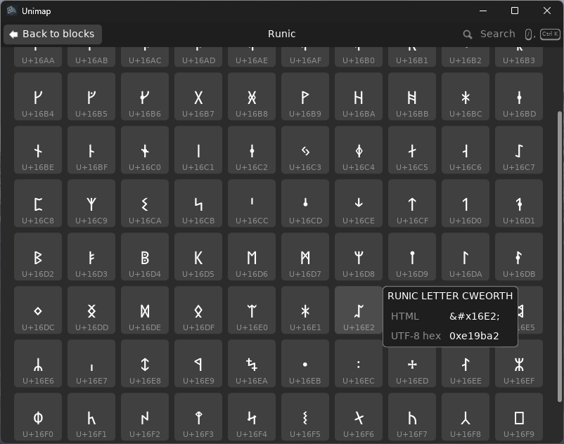

# unimap
A modern take on Character Map, and with the entire Unicode character set



### [Handmade Network project page](https://handmade.network/p/805/unimap/)

This is my entry into the [2026 Handmade Essentials Jam](https://handmade.network/jam/essentials).

> [!NOTE]
> Currently, only runs on Windows. Shouldn't be too hard to port though.

## Build instructions
1. create the `gen-names-bins/out` directory
    ```bash
    mkdir gen-names-bins/out
    ```
1. create two symlinks:
    - a symlink called `unicode` in `gen-names-bins/src/` that points to `src/unicode`
    - a symlink called `names-bins` in `src/unicode/` that points to `gen-names-bins/out`
    Powershell:
    ```powershell
    # You must run these with Administrator permissions
    New-Item -ItemType SymbolicLink -Path "path/to/gen-names-bins/src/unicode" -Target "path/to/src/unicode"
    New-Item -ItemType SymbolicLink -Path "path/to/src/unicode/names-bins" -Target "path/to/gen-names-bins/out"
    ```
1. generate the character name binaries
    ```powershell
    cd gen-names-bins
    zig build
    ./zig-out/bin/gen-names-bins.exe
    ```

All of this should be able to be done in `build.zig`, I will get to that soon
